# TODO APP API

This Todo API is a web service that allows users to manage their tasks. It provides several endpoints for creating, retrieving, updating, and deleting tasks.
This API is made using NodeJS and MongoDB as Backend.

### API Hosted Link

https://todo-api-3yse.onrender.com
Initially this will take some time as Server is started again (around 40s to 1m). This is the limitation of Render's Free Teir. And also Latency is quite high 800ms to 1200ms afterward. So please understand that.

## Application Mechanism

- There can be 2 types of Users

  1. Regular User
  2. Admin User

- Regular users can only Add thier own task, get their all Update their Task and Delete their Task.
- Admin users can see all users, all the tasks, assign existing tasks or assign completely new task.

## Tasks Performs

_It facilitates the Users in:_

- in Registration
- in Login
- in their authentication(done by JWT).
- Todo Task Creation.
- Updating the Task.
- Fetching their all Tasks.
- Fetching the task with some Filters
- Deleting their Tasks.

_It facilitates the Admin in:_

- in Registration
- in Login
- in their authentication(done by JWT).
- Getting all the User Info.
- Getting all Tasks present in Database.
- Assigning existing or new Task to Users.

## Routes and their responses

1. POST /api/auth/register

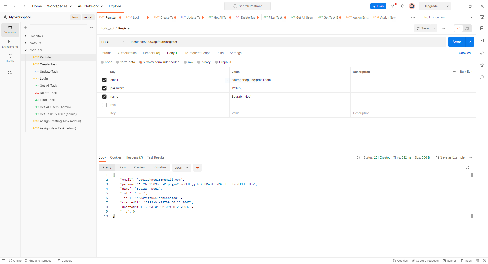

2. POST /api/auth/login

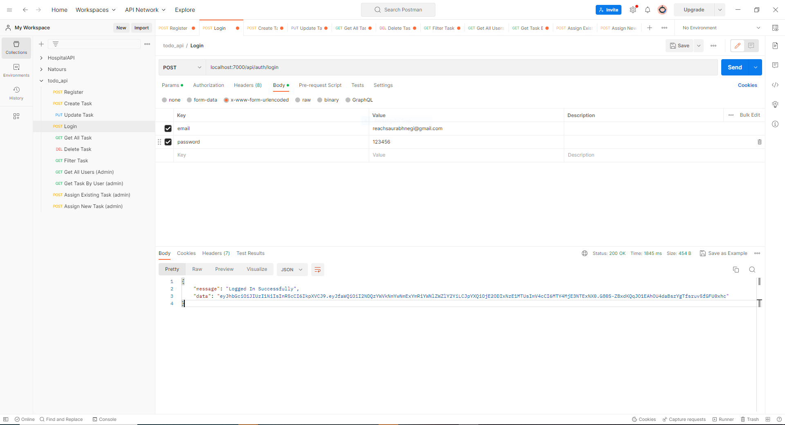

- Providing JWT to Authorization key in Header for Authorizing the user.

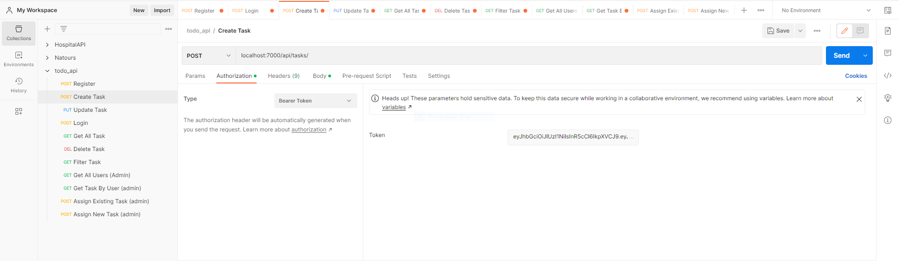

3. POST /api/tasks/

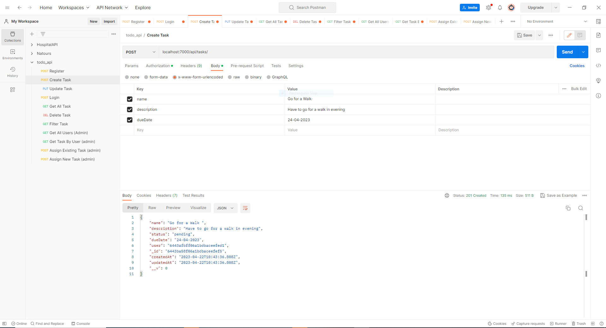

4. GET /api/tasks/getAllTasks

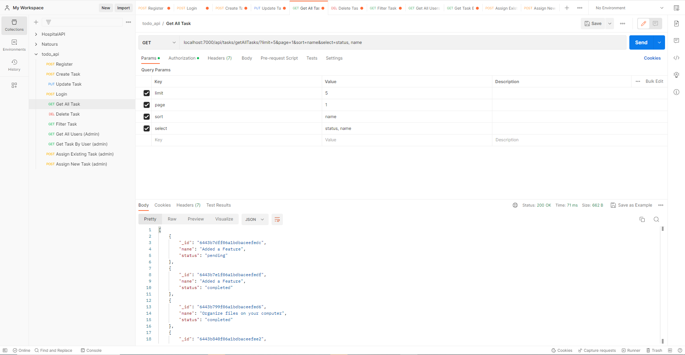

5. GET /api/tasks/filterTask

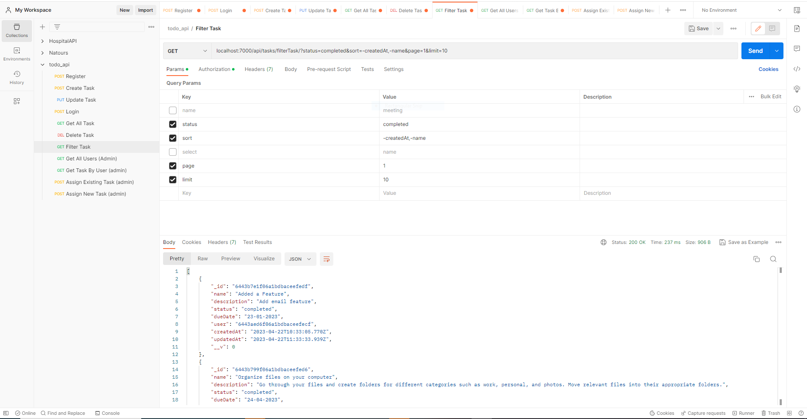

6. PUT /api/tasks/:taskId

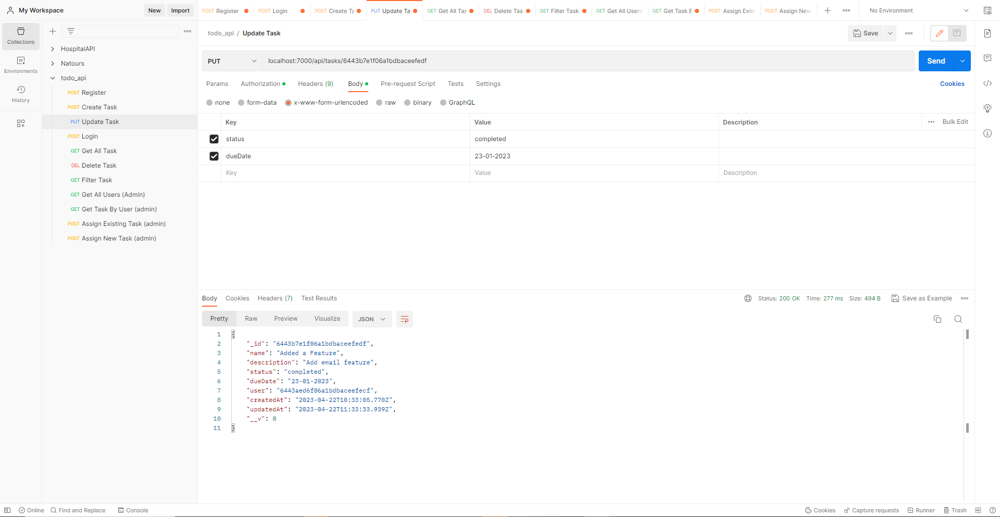

7. DELETE /api/tasks/:taskId

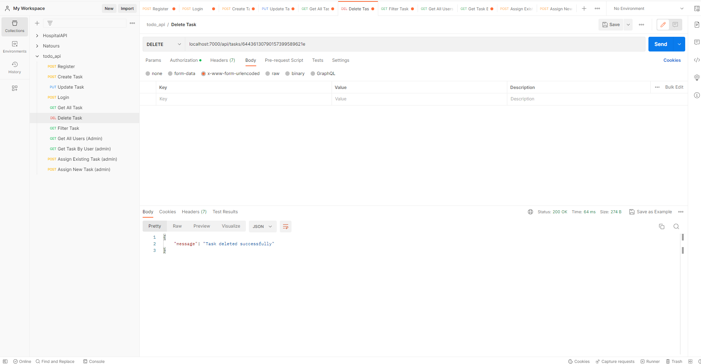

8. GET /api/tasks/getAllUsers

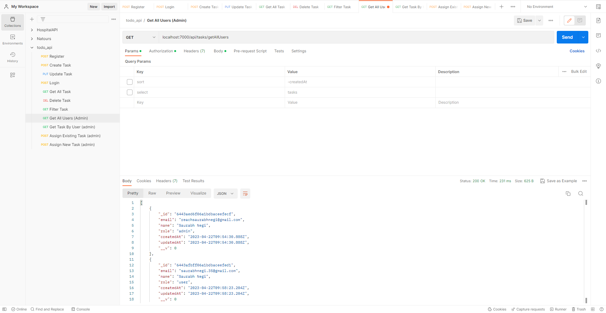

9. GET /api/tasks/getTask/:userId

10. POST /api/tasks/assignExistingTask

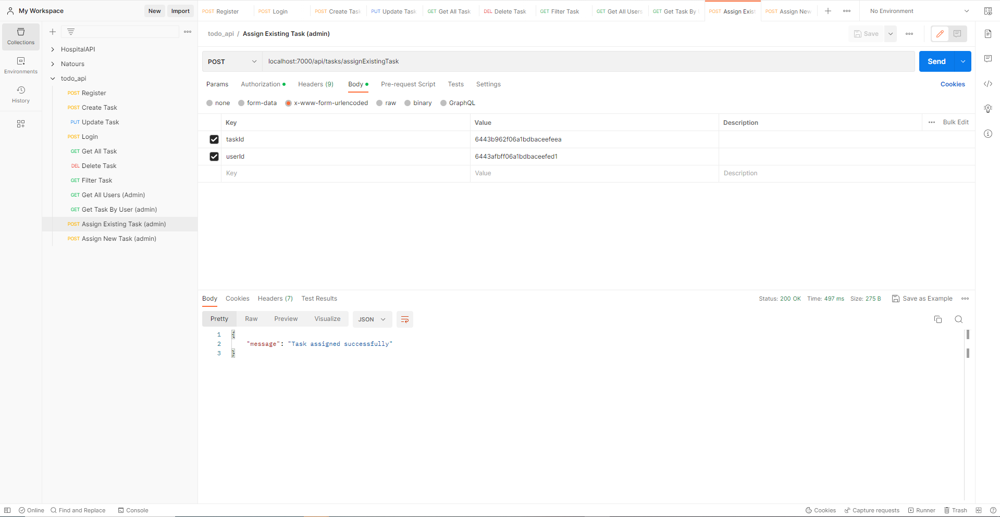

11.POST /api/tasks/assignNewTask

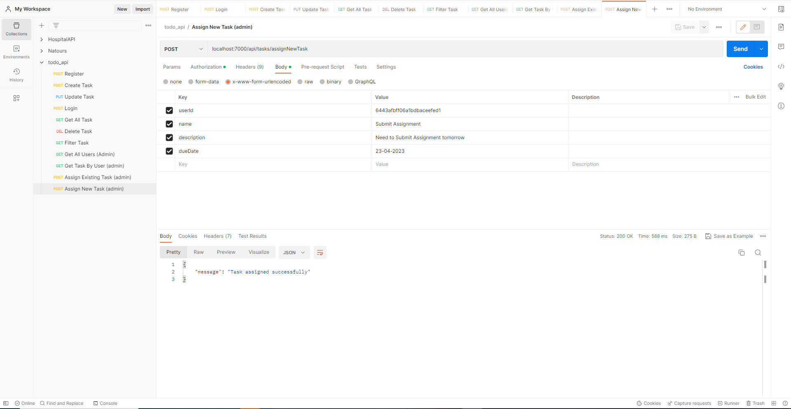

## Folder Structure

- Assets- It contains images files.
- Models- Contains 2 models of the project thAT are User and Task.
- Controllers- Actions for Authentication, Regular User Tasks and Admin User Tasks.
- Routes- Routes Handlers for varoius URLs.
- Config- Contains Authentication Middleware and Mongoose Connection setup.
- app.js- Application File.
- server.js - The main entry point for the Application

## How to setup the Project

- Clone the project.
- Go to correct directory.
- Connect to mongodb.
- npm install the required dependencies.
- Run command: npm start
- Go to https://localhost/7000
- Keep the Postman App handy.

## Libraries Used

- bcrypt
- dotenv
- express
- jsonwebtoken
- mongoose
- nodemailer
